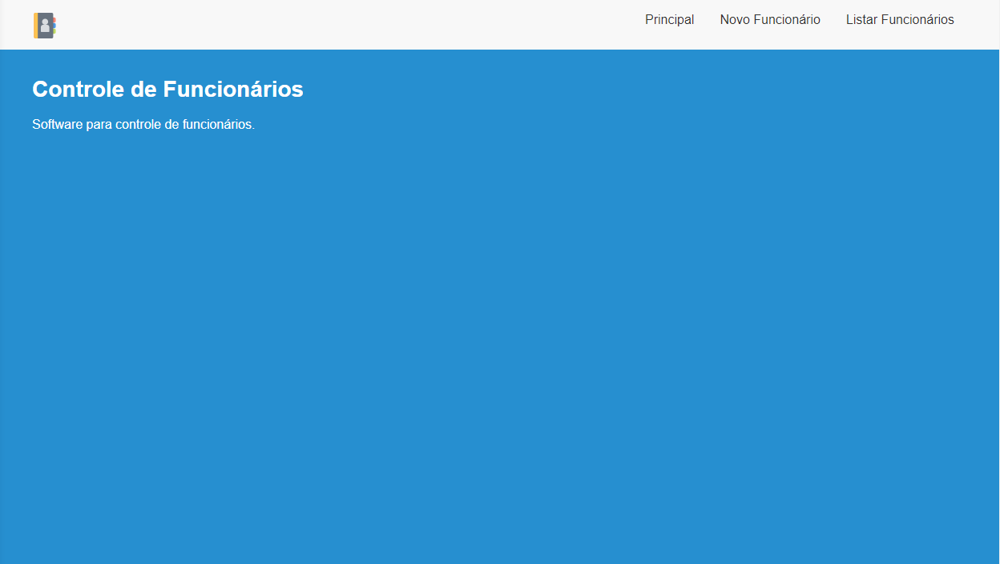
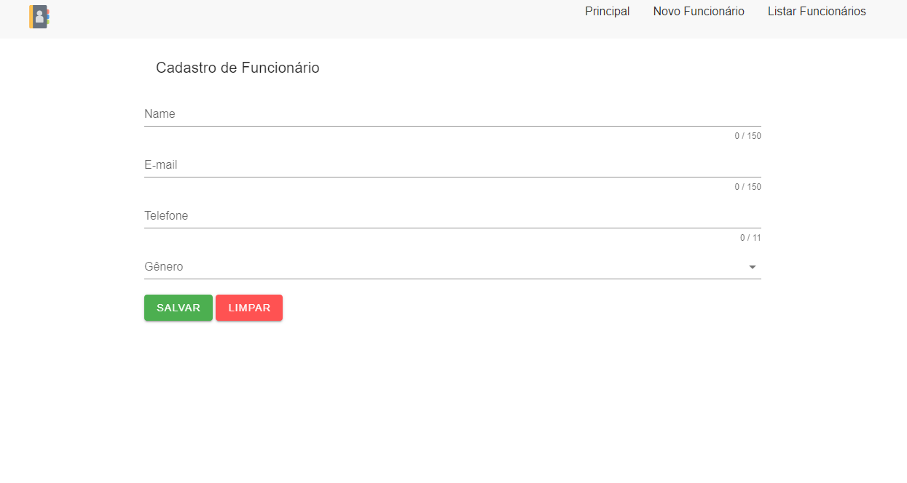
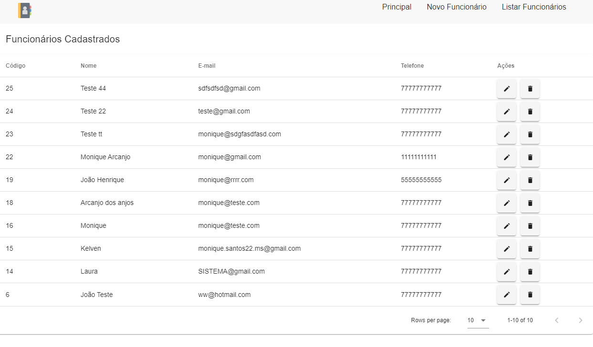
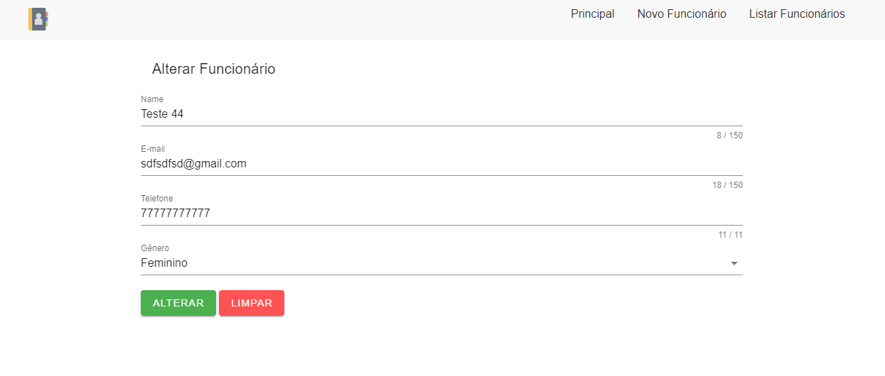
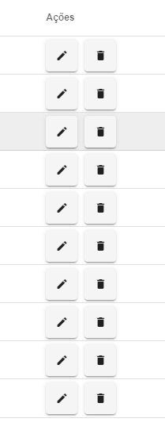

# Sobre

Manager é um software simples que gerencia funcionários.

# Banco de dados

O banco de dados utilizado foi o MySQL, foi criada apenas uma tabela:

    CREATE TABLE employees(
        id INT NOT NULL AUTO_INCREMENT,
        name VARCHAR(150) NOT NULL,
        email VARCHAR(150) NOT NULL,
        telephone VARCHAR(11) NOT NULL,
        gender VARCHAR(1) NOT NULL,
        PRIMARY KEY(`id`)
    ) ENGINE = InnoDB;

***Observação*** : A conexão foi feita com PDO

# Apresentando as telas
## Tela Principal

----------

## Tela de Cadastro de Funcionário

----------

## Tela de Listagem dos Funcionários

----------

## Tela de Edição

----------

## Opções disponível na listagem

# Visão geral do código

## Pastas

- `Database` - Contém a conexão com o banco
- `app/Models` - Contém os modelos
- `app/Http/Controllers` - Contém todos os controladores de API
- `app/Http/Requests` - Contém o filtro das requisições e validações do form enviado
- `app/Interfaces` - Contém todas as interfaces criadas
- `app/Repositories` - Contém todas os repositórios criados
- `app/Services` - Contém a lógica necessária para executar as regras de negocio
- `database/factories` - Contém a fábrica de modelos para todos os modelos
- `Route` - Contém a validação da rota, feita para respeitar os verbos HTTP
- `css` - Contém o estilo do projeto
- `img` - Contém as imagens usadas
- `view_php` - Contém o html das telas criadas
- `view_php/js` - Contém o js usado nas telas
- `route.php` - Contém as rotas

## Rotas

- `GET - employeeAll` - Retorna todos os funcionários ordenado pelo id(decrescente)
- `GET - employee/id` - Retorna o funcionário pelo id
- `POST - employee` - Insere um funcionário novo
- `PUT - employee/id` - Altera o funcionário que foi passado pelo id
- `DELETE - employee/id` - Deleta o funcionário que foi passado pelo id

----------

# Autor

 
  
 <b>Monique Arcanjo</b>

👋🏽 Entre em contato!

 

